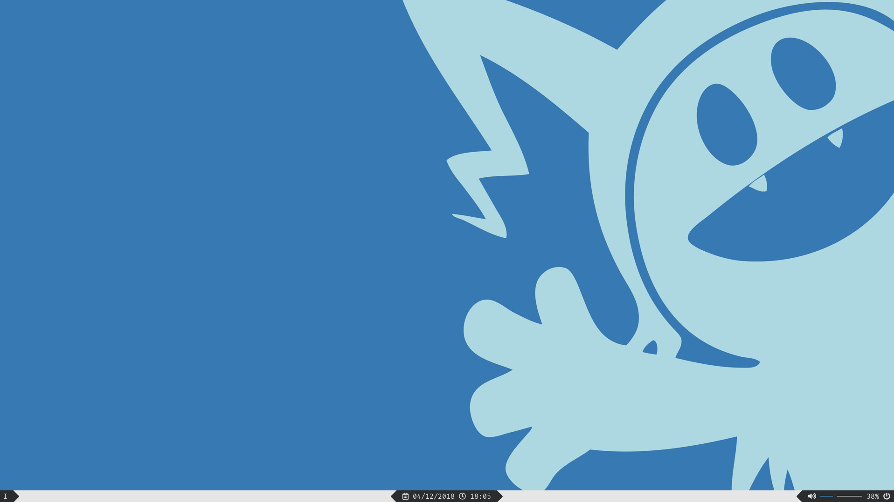
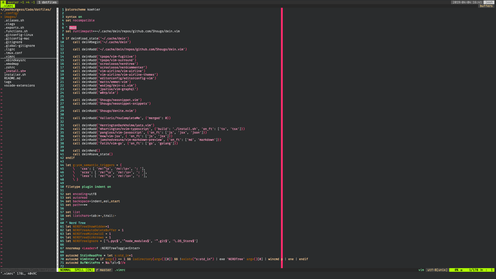

# Dotfiles

These are my dotfiles that I use on both Mac and Linux, most files are cross compatible, anything that isn't has a separate version for each OS.

## Screenshots

## Required fonts
* [Devicons](http://konpa.github.io/devicon/)
* [Fira Code](https://github.com/tonsky/FiraCode)
* [Font Awesome](https://fontawesome.com/)
